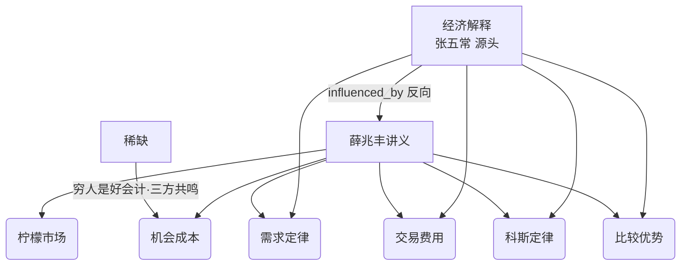
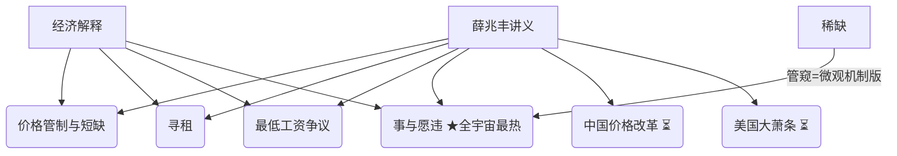
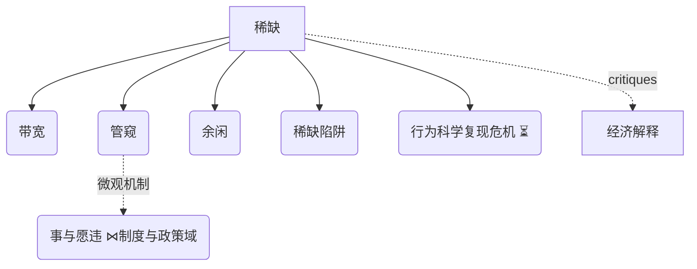
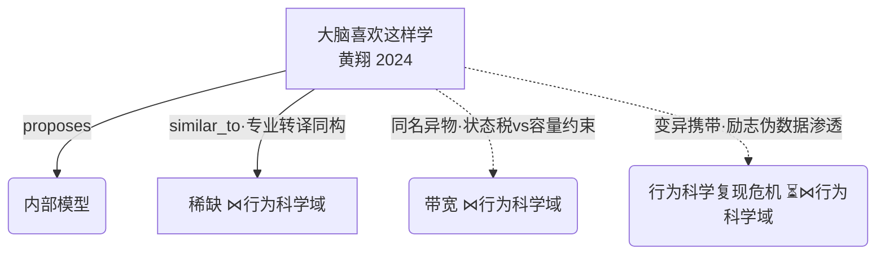
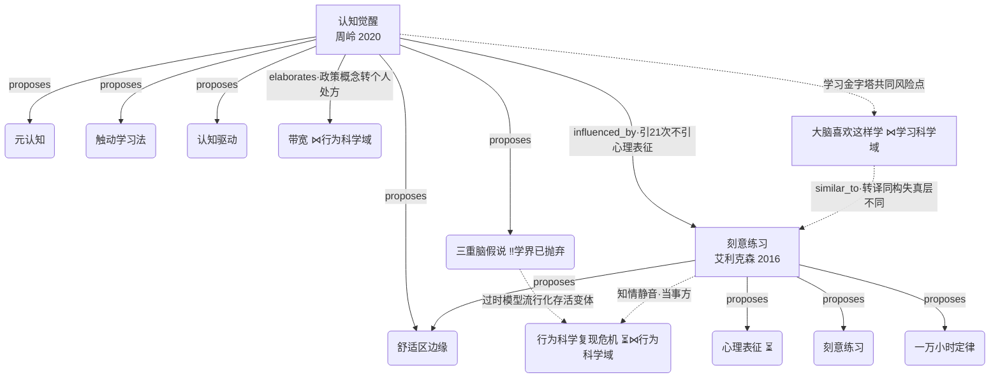
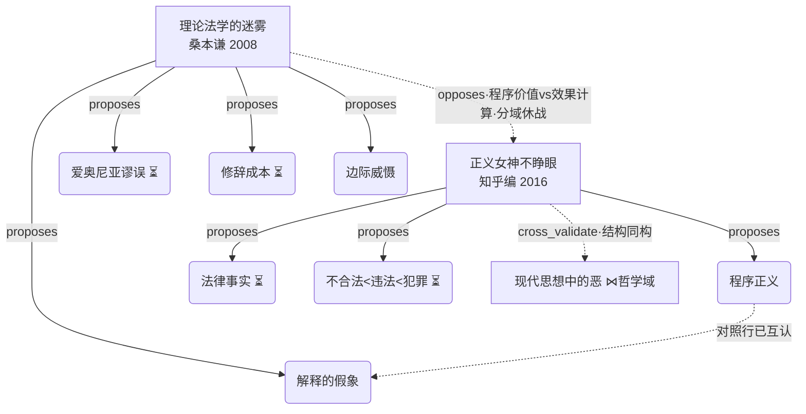
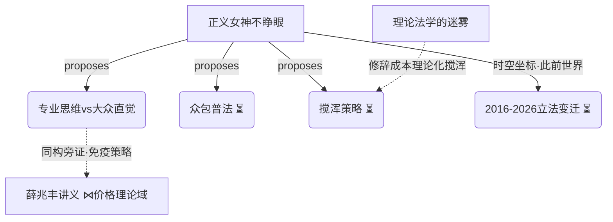
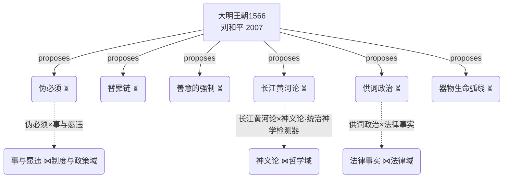
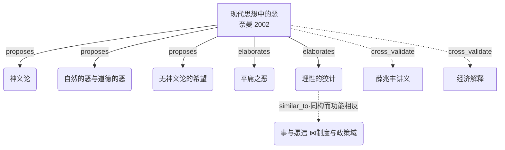
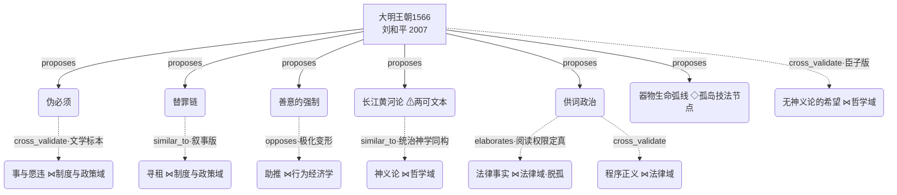

# 阅读宇宙

> 每拆一本书，宇宙生长一次。书目表由 universe_rebuild.py 维护（AUTO 区块）；
> 主题域子图与最近涌现由拆书流程（step 4）+ Dream 维护。
> Dream-001（2026-09-16）：经济学域 15 节点超限，拆分为「价格理论」「制度与政策」两子域；「行为科学」独立成域；三个时空背景节点脱孤。

<!-- AUTO:books:start -->
## 书目

| 书 | 作者 | 类型 | 拆书日期 | 概念数 |
|---|---|---|---|---|
| [经济解释（四卷本）](books/jing-ji-jie-shi.md) | 张五常 | ideas 0.6 + knowledge 0.25 + narrative 0.15 (经济学理论论著) | 2026-09-16 | 9 |
| [「错误」的行为](books/misbehaving.md) | 理查德·塞勒 | ideas 0.75 + narrative 0.25 (行为经济学形成史·编年战史) | 2026-09-17 | 4 |
| [薛兆丰经济学讲义](books/xue-zhao-feng-jing-ji-xue-jiang-yi.md) | 薛兆丰 | knowledge 0.55 + ideas 0.45 (通俗经济学讲义) | 2026-09-15 | 12 |
| [大脑喜欢这样学](books/da-nao-xi-huan-zhe-yang-xue.md) | 黄翔 | knowledge 0.6 + ideas 0.4 (脑科学科普×学习方法论) | 2026-09-16 | 3 |
| [认知觉醒：开启自我改变的原动力](books/ren-zhi-jue-xing.md) | 周岭 | knowledge 0.6 + ideas 0.4 (自助成长方法论·转述集成型工具书) | 2026-09-16 | 6 |
| [稀缺：我们是如何陷入贫穷与忙碌的](books/scarcity.md) | 塞德希尔·穆来纳森 & 埃尔德·沙菲尔 | ideas 0.75 + knowledge 0.25 (行为科学科普论著) | 2026-09-16 | 7 |
| [思考，快与慢](books/thinking-fast-slow.md) | 丹尼尔·卡尼曼 | ideas 0.7 + knowledge 0.3 (判断与决策理论综述·行为科学集成) | 2026-09-17 | 4 |
| [刻意练习](books/keyi-lianxi.md) | 安德斯·艾利克森 & 罗伯特·普尔 | knowledge 0.8 + ideas 0.2 (学习方法论·专长研究转译) | 2026-09-17 | 4 |
| [理论法学的迷雾](books/lilun-fazue-miwu.md) | 桑本谦 | ideas 0.85 + knowledge 0.15 (社科法学/法律经济学论战集) | 2026-09-17 | 4 |
| [正义女神不睁眼](books/zhengyi-nvshen-buzhengyan.md) | 知乎 编（37 位从业者） | knowledge 0.7 + ideas 0.3 (法律通识问答集·众包普法) | 2026-09-17 | 7 |
| [现代思想中的恶](books/evil-in-modern-thought.md) | 苏珊·奈曼（Susan Neiman） | ideas (哲学思想史) | 2026-09-16 | 5 |
| [大明王朝1566](books/da-ming-wangchao-1566.md) | 刘和平 | fiction 0.9 + ideas 0.1 (历史政治小说·宇宙首个 fiction) | 2026-09-18 | 6 |

<!-- AUTO:books:end -->

## 主题域子图

### 价格理论（张→薛 主脉）

### 制度与政策

（⏳ = 时空背景节点，Dream-001 脱孤）

### 行为科学（scarcity 冷启动域）

### 学习科学（2026-09-16，《大脑喜欢这样学》冷启动域）

### 认知成长·学习科学域（2026-09-16 冷启动；2026-09-17 《刻意练习》入域，Dream-002 合并视图）

（‼ = 学界地位注记；《刻意练习》为复现危机当事方文献，2026-09-17 入域）

### 法律·法理思维（2026-09-17 由原「法律通识」拆分，Dream-002）

### 法律·知识社会学与时效（2026-09-17 由原「法律通识」拆分，Dream-002）

（⏳ = 待连接：仅单一来源书，Dream-002 标记，等第二本书碰撞；法律域按 12 节点上限预拆分为「法理思维」「知识社会学与时效」两子图，为 frontier 后续 8 本法律书留位）

### 文学叙事 · 历史政治小说（2026-09-18，《大明王朝1566》冷启动域）

（⏳ = 待连接：单源新概念，等第二本书碰撞；三条虚线为 Dream-003 落地的跨域桥）

### 哲学 · 恶与希望

### 文学叙事 · 历史政治小说（2026-09-18《大明王朝1566》冷启动——宇宙首个 fiction 域）

（⚠ = 红队标注全书最大两可文本；◇ = 只入库不连线；⋈ = 跨域连接点。fiction 域与既有六域的连接全部为概念级边，书级不硬连）

（⋈ = 跨域连接点，节点归属括号内标注的域；★ = 全宇宙度数最高节点）

## 最近涌现

- 2026-09-18《大明王朝1566》× 六域碰撞：**fiction 冷启动**——伪必须 cross_validate 事与愿违（意图层自造「别无选择」，文学标本）；长江黄河论 similar_to 神义论（统治神学同构，⚠ 两可文本限定）；供词政治 elaborates 法律事实（**⏳法律事实脱孤**：文书之真由阅读权限决定）；善意的强制 opposes 助推（退出成本抬到饥饿的极化变形）；替罪链 similar_to 寻租（收网人在权力顶点）。涌现 6 条已裁决入格（persona v13，见 emergent.md）

- 2026-09-17《刻意练习》×《认知觉醒》：**influenced_by 源流对首例**——引 21 次却不引「心理表征」，拆件变形实锤；×《大脑喜欢这样学》转译同构（失真层不同）；挂入复现危机当事方。涌现 3 条待裁决（知情静音律/必要充分拆分律/辟谣者悖论，proposals/proposal-v10）
- 2026-09-17《理论法学的迷雾》×《正义女神不睁眼》：**法律域首战 opposes 边**——程序价值 vs 效果计算，裁决「分域休战」（常规域程序守、疑难域经济学赢）；×《经济解释》cross_validate（同上游科斯两条互不引证支流：威慑博弈 vs 需求定律）——**法律-经济跨域实边**；×哲学域反意图主义呼应。涌现 3 条待裁决（全称写法税/揭雾者的雾/分域休战律，proposals/proposal-v9）
- 2026-09-16《认知觉醒》×《稀缺》：**adapts 边首例**——带宽从政策论证（制度减负）转译为个人修行处方（五帖药）；蔗农研究双向转述忠实，但地基自身无大样本直接复制、2024 元分析定调小效应（新知识点卡 kp-sugarcane，双向警示）；涌现 4 条**已裁决（2026-09-17）**：3 入思想立场、1 改后转思维工具箱 → persona v7（见 emergent.md）
- 2026-09-16《大脑喜欢这样学》×《稀缺》：**带宽同名异物**——状态税（稀缺征收的动态折价）vs 容量约束（硬件静态上限），两书把同一物理隐喻各取一半；**复现危机新变体**——脑科学书对心理学励志伪数据（学习金字塔/哈佛目标调查）过滤不设防
- 2026-09-16《大脑喜欢这样学》涌现候选 3 条入待裁决（见 emergent.md）：整合型的失真在出处层 / 伪数据的修辞器官说 / 注意力经济学合并公式
- 2026-09-16《现代思想中的恶》×经济学域：**跨域首线**——理性的狡计 `similar_to`（同构而功能相反）事与愿违 [原文·L9490-9491 奈曼亲笔把"看不见的手"列为天意替代品]；书级 cross_validate 双边（薛兆丰、张五常）
- 2026-09-16 涌现候选 3 条入待裁决（见 emergent.md）：神义论检测器判准 / 安慰与检验互斥律 / 恶域伸缩循环 → 前两条入格、第三条拒绝留痕
- 2026-09-16 Dream-001：三时空节点脱孤；经济学域拆分三域；内化候选 1 条待裁决（见 dream-report）
